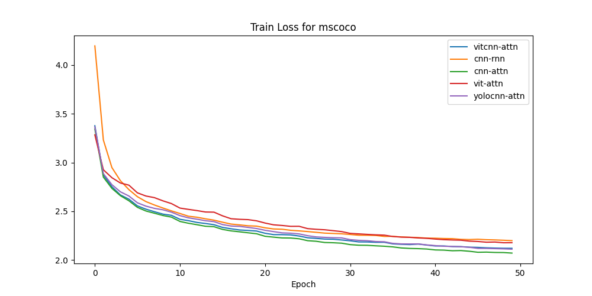
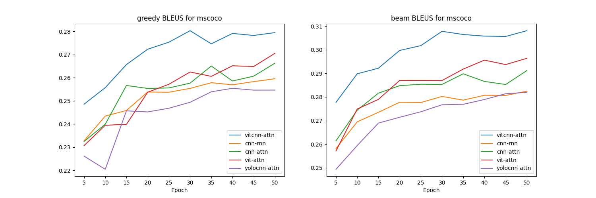
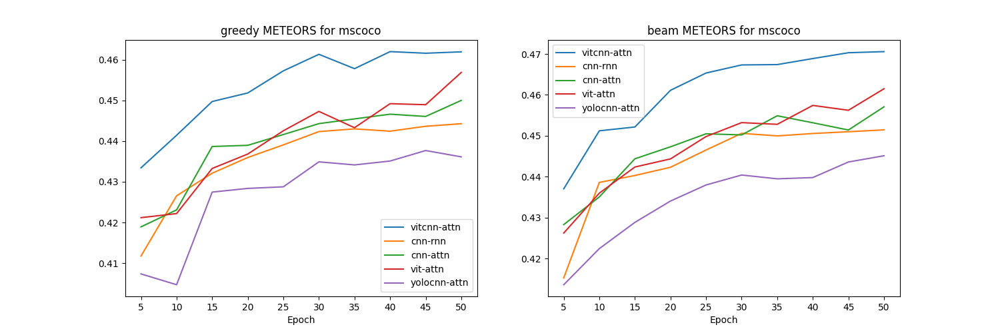
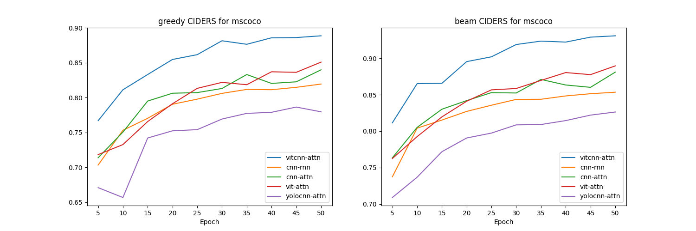
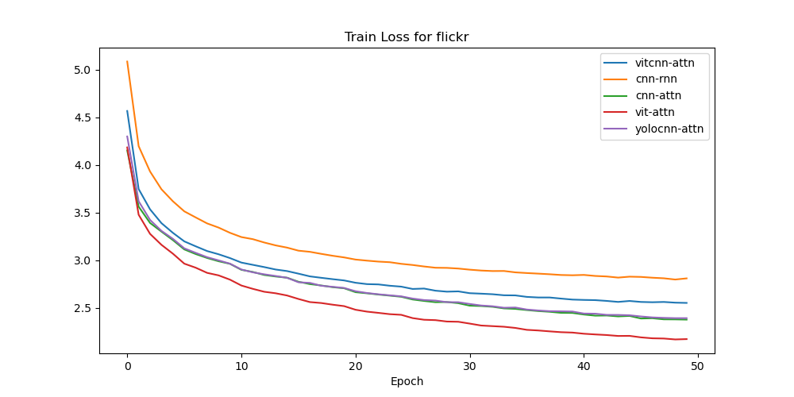
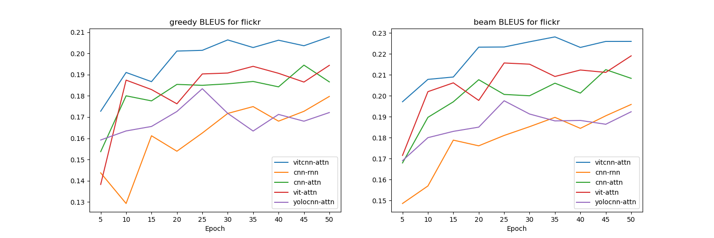
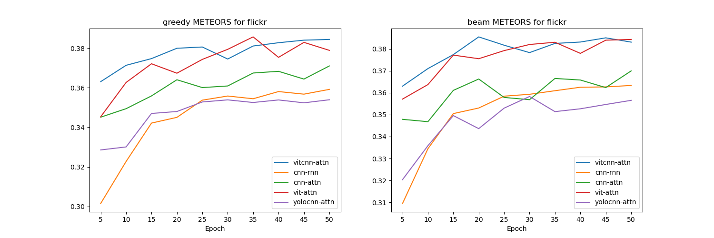
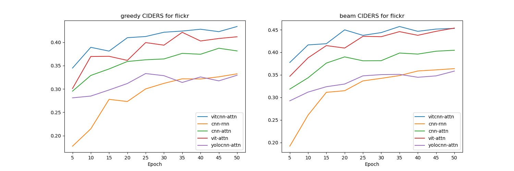

# Image Captioning Project

## About
This project aims to create an automated image captioning system that generates natural language descriptions for input images by integrating techniques from computer vision and natural language processing. We employ various techniques ranging from CNN-RNN to more advanced transformer-based methods. Training is conducted on datasets of images paired with descriptive captions, and model performance is evaluated using established metrics such as BLEU, METEOR, and CIDEr. The project also involves experimentation with advanced attention mechanisms, comparisons of different architectural choices, and hyperparameter optimization to refine captioning accuracy and overall system effectiveness.

You can access the report [here](./Image_Captioning_Report.pdf).

## Models
We architected five different models, experimenting with different model blocks such as ViT, InceptionV3, and YOLO for the image encoder, and LSTM and Transformer Decoder for the decoder:
- CNN-RNN
- CNN-Attn
- ViT-Attn
- ViTCNN-Attn
- YOLOCNN-Attn

## Sample Captions Generated


## Environment
```bash
conda env create -f environment.yml
source activate SC4001
```

## Datasets
For this experiment, we utilized two datasets:
- MSCOCO
- Flickr30k

```bash
sh download-datasets.sh
```

## Metrics
We utilized BLEU, METEOR, and CIDEr to evaluate the generated captions by the models.

## Training 
Training is done with the training and validation split.

For training with the config script, create a config YAML file inside the config folder and run the `train.py` file. You can refer to the `sample_train_command.sh` for more examples.
```bash
python train.py --config_file config-mscoco-cnnrnn.yaml ---embed_size={embed_size} \
                --batch_size={batch_size} --learning_rate={learning_rate}
```

For hyperparameter tuning, input the parameter search space in `grid_train_script` and run:
```bash
python grid_train_script.py
```

## Evaluation
Evaluation is done on the test dataset split to provide the final model score on unseen training data.

For evaluation, you can run the `eval.py` with the given arguments as in training without the need to specify the config file. Example:
```bash
python eval.py --batch_size={batch_size} --learning_rate={learning_rate} --embed_size={embed_size} \
               --num_layers={num_layers} --model_arch={model} --dataset={dataset} \
               --checkpoint_dir={checkpoint_dir}
```

If you tuned the hyperparameters, you can run `select_and_eval_model.py` to evaluate the best model based on training logs. It will generate graphs of the best models and sample captions in the eval folder.
```bash
python select_and_eval_model.py
```

## Experiment Results
#### MSCOCO





#### Flickr30k




